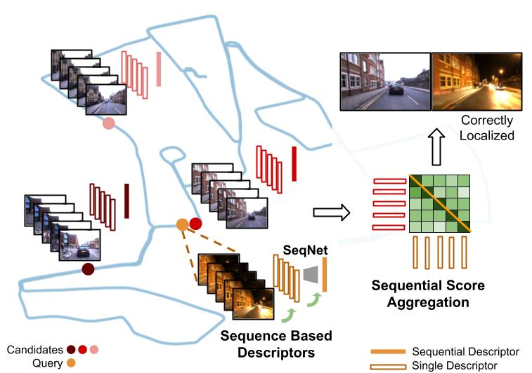

# SeqNet: Sequence-based Hierarchical Place Recognition
Code to be released soon.

The arXiv pre-print can found [here](https://arxiv.org/abs/2102.11603) along with the supplementary material.

<p align="center">
  
    <br/><em>Sequence-Based Hierarchical Visual Place Recognition.</em>
</p>

### Citation
```
@article{garg2021seqnet,
  title={SeqNet: Learning Descriptors for Sequence-based Hierarchical Place Recognition},
  author={Sourav Garg and Michael Milford},
  journal={IEEE Robotics and Automation Letters (in press)},
  volume={},
  number={},
  pages={},
  year={2021},
  publisher={IEEE}
}
```
